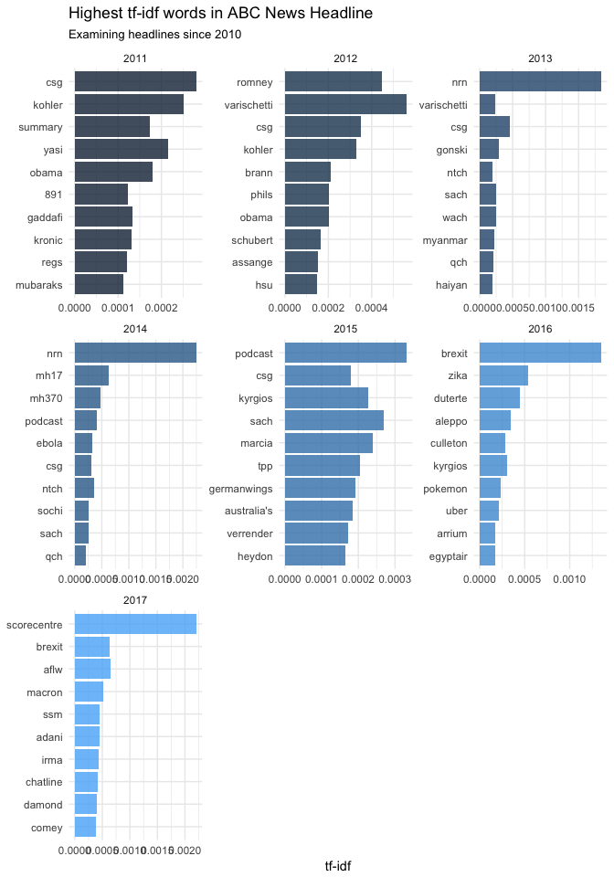

ABC
================
J Flynn
09/04/2018

Text Analysis using data from 'A Million News Headlines' <https://www.kaggle.com/therohk/million-headlines>

Context
=======

This contains data of news headlines published over a period of 15 years. From the reputable Australian news source ABC (Australian Broadcasting Corp.)

Site: <http://www.abc.net.au/>

### Stories Per Day

How many stories are published by ABC News Australia per day? - I didn't expect to find anything that new here. I really just wanted to see how complete the data set is.

Its difficult to see how meaningful the downward trend in storylines is. But we can see that Weekends generate considerably fewer stories.

### Most Common Words

What are the most common words used in ABC headlines? Here we just taken a straight count of the words.

    ## # A tibble: 98,094 x 2
    ##    word          n
    ##    <chr>     <int>
    ##  1 police    35985
    ##  2 govt      16923
    ##  3 court     16380
    ##  4 council   16343
    ##  5 interview 15025
    ##  6 fire      13910
    ##  7 nsw       12912
    ##  8 australia 12353
    ##  9 plan      12307
    ## 10 water     11874
    ## # ... with 98,084 more rows

### Tracking Occurences

So we know which words occur the most. Are there seasonal trends to these occurences?

### TF IDF Over Time

We've seen overall counts of words above. Let's now look at how common words are using TF-IDF and breaking out the numbers by year.

### Word Vector

We've now got a pretty good idea of how common certain words are, or at least we have a few really nice methods for looking at this.

Lets now build up a method for looking at which words are most associated.

